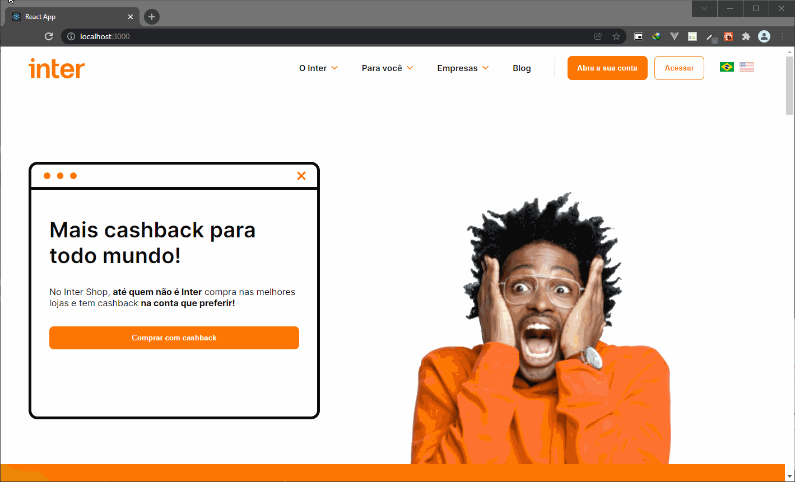
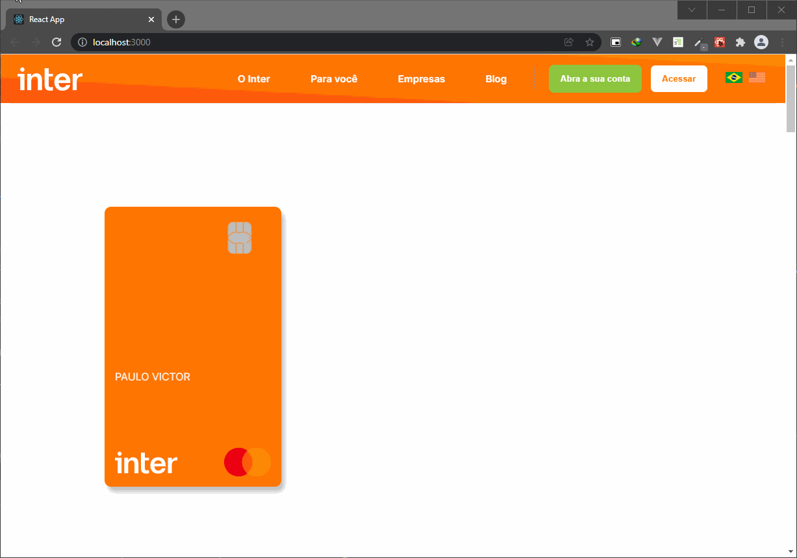

# Inter Banco - Clone Interface 

🏆 Projeto para portifólio um clone da interface da página web do Inter utilizando as técnicas e tecnologias:

**React TypeScript | Internationalization i18n | Styled Components  | Atomic Design**

<br/>



<br/>



<br/>

## Instalando as dependências e executando

```bash
npm install
npm run dev
```

## Todo (em andamento)

- Implementar mais testes
- Utilizar o Zustand como gerenciador de estados
- Componentizar os elementos dos formulários
- Integrar com libs para validação formulário
- Finalizar layout web
- Iniciar layout mobile